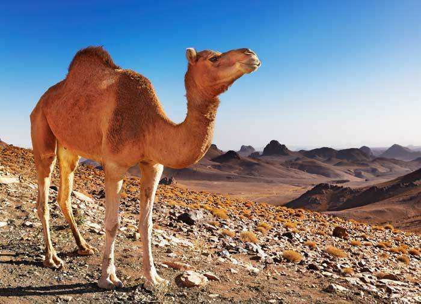

<!DOCTYPE html>
<html>
<head>
<h1> Camel Industries </h1>
</head>
 
 <body>

<h1>Camel Wave</h1>

<a href="https://www.youtube.com/watch?v=6ll4-OiLn4E">Camel Video</a> Click this link for Camel Culture

<h2> </h2>
<h3>

The place to rent

<strong>Live with the camels.</strong>
</body>
<h3>Want to buy a Camel </h3>

submit your contact information here

<button type="button"
onclick="document.getElementById('demo').innerHTML = Date()">
Click me to display Date and Time.</button>

